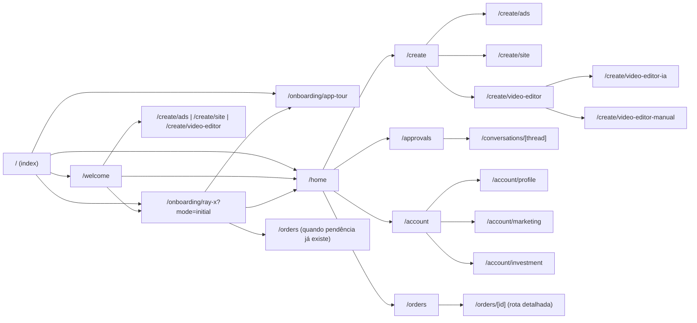
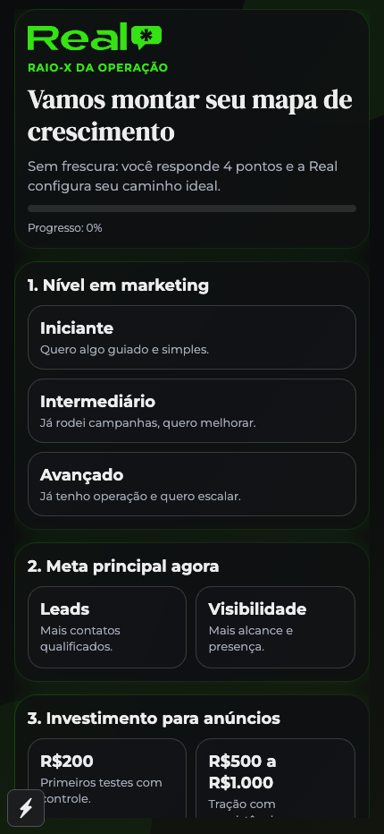
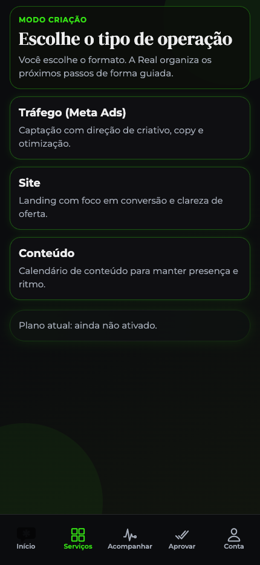
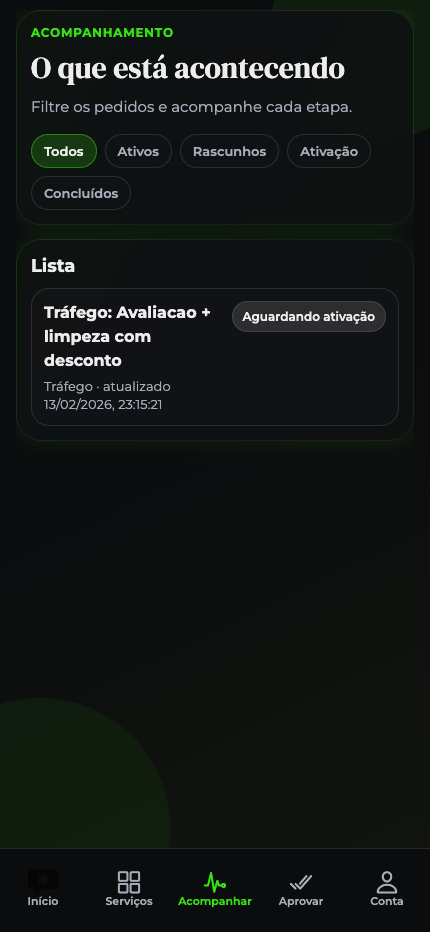
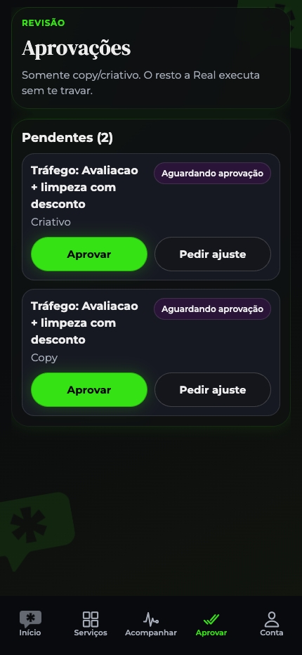
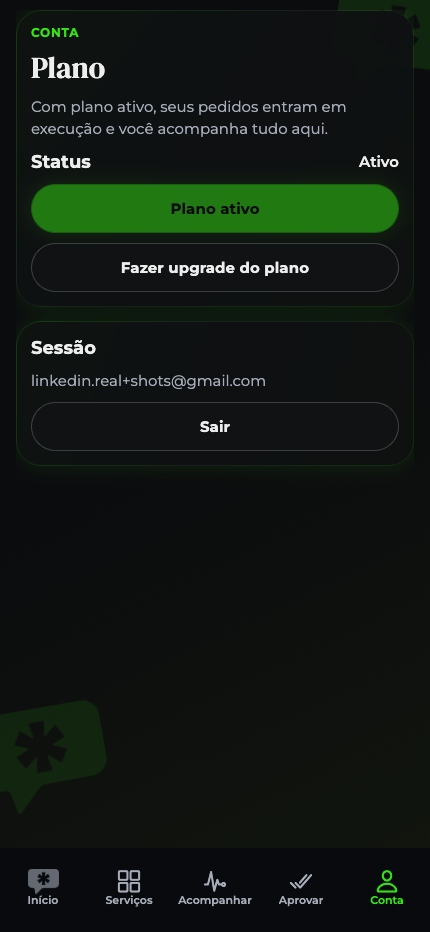
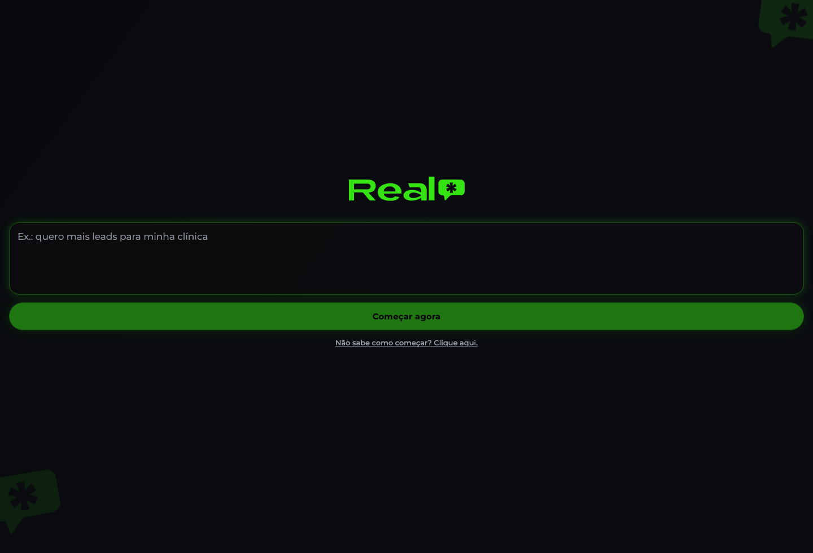

# RealApp Frontend Screenbook (Mobile + Rotas)

Atualizado em: 2026-02-25 (UTC)

## 1) Objetivo
Este documento mostra **todas as telas do frontend** do app Expo (`real-mobile-mvp`) para alguém que nunca viu o produto.

Cobertura:
- mapa de navegação
- inventário de rotas (incluindo aliases/redirects)
- o que aparece em cada tela
- principais ações do usuário
- estados vazios/erro/carregamento
- prints disponíveis no repositório

## 2) Stack visual e navegação
- Framework mobile: React Native + Expo Router
- Layout raiz: `app/_layout.tsx`
- Navegação principal por abas: `app/(tabs)/_layout.tsx`
- Design system base:
  - tema: `src/theme/realTheme.ts`
  - fontes: Montserrat (body) + DM Serif Display (títulos)
  - cores-chave: verde `#35E214`, fundo escuro, texto claro

## 3) Mapa de fluxo (alto nível)

## 4) Regras de entrada (gates)
No bootstrap (`app/index.tsx`):
1. não autenticado -> `/welcome`
2. autenticado, mas cadastro mínimo incompleto -> `/onboarding/ray-x?mode=initial`
3. cadastro mínimo ok, tour do app não concluído -> `/onboarding/app-tour`
4. caso contrário -> `/home`

No layout de abas (`app/(tabs)/_layout.tsx`) as mesmas travas são reaplicadas.

## 5) Inventário completo de rotas
| Rota | Tipo | O que é | Arquivo |
|---|---|---|---|
| `/` | bootstrap | redirecionador inicial baseado em auth/onboarding/tour | `app/index.tsx` |
| `/welcome` | tela | entrada principal com prompt + modais de auth/serviços | `app/welcome.tsx` |
| `/welcome_auth_modal` | redirect | alias para abrir auth modal | `app/welcome_auth_modal.tsx` |
| `/welcome_loading_modal` | redirect | alias para estado de loading | `app/welcome_loading_modal.tsx` |
| `/welcome_services_modal` | redirect | alias para modal de serviços | `app/welcome_services_modal.tsx` |
| `/onboarding/ray-x` | tela | onboarding em modo `initial` ou `production` | `app/onboarding/ray-x.tsx` |
| `/onboarding/ray-x_mode_initial` | redirect | alias modo inicial | `app/onboarding/ray-x_mode_initial.tsx` |
| `/onboarding/ray-x_mode_production` | redirect | alias modo produção | `app/onboarding/ray-x_mode_production.tsx` |
| `/onboarding/app-tour` | tela | bootstrap do tour guiado (overlay) | `app/onboarding/app-tour.tsx` |
| `/onboarding_app-tour` | redirect | alias do tour | `app/onboarding_app-tour.tsx` |
| `/home` (grupo `(tabs)`) | aba | home com prompt inteligente e roteamento de intenção | `app/(tabs)/home.tsx` |
| `/create` (grupo `(tabs)`) | aba | hub visual de serviços | `app/(tabs)/create.tsx` |
| `/orders` (grupo `(tabs)`) | aba | dashboard de resultados/performance | `app/(tabs)/orders.tsx` |
| `/approvals` (grupo `(tabs)`) | aba | lista estilo inbox de entregas/conversas | `app/(tabs)/approvals.tsx` |
| `/account` (grupo `(tabs)`) | aba | status da conta, checklist e plano | `app/(tabs)/account.tsx` |
| `/create/ads` | tela | wizard conversacional de tráfego (com upload de mídia) | `app/create/ads.tsx` |
| `/create/site` | tela | gerador de site com IA + preview WebView + publicar | `app/create/site.tsx` |
| `/create/content` | tela | placeholder “Em breve” | `app/create/content.tsx` |
| `/create/video-editor` | tela | hub de escolha IA vs manual | `app/create/video-editor.tsx` |
| `/create/video-editor-ia` | tela | funil de edição IA (upload -> modo -> legenda -> processamento -> pronto) | `app/create/video-editor-ia.tsx` |
| `/create/video-editor-manual` | tela | editor manual completo (timeline, cortes, texto, export) | `app/create/video-editor-manual.tsx` |
| `/create/video-editor-manual-hub` | tela auxiliar | hub alternativo para preparo manual | `app/create/video-editor-manual-hub.tsx` |
| `/orders/[id]` | tela dinâmica | detalhe de pedido, entregas, aprovações e timeline | `app/orders/[id].tsx` |
| `/conversations/[thread]` | tela dinâmica | conversa por profissional, anexos e histórico | `app/conversations/[thread].tsx` |
| `/account/profile` | tela | dados da empresa | `app/account/profile.tsx` |
| `/account/marketing` | tela | preferências estratégicas (Raio-X) | `app/account/marketing.tsx` |
| `/account/investment` | tela | orçamento mensal e saldo pré-pago | `app/account/investment.tsx` |

## 6) Tela a tela

### 6.1 Welcome (`/welcome`)
Visual:
- logo Real
- título “Descreva seu objetivo”
- campo de texto principal (multiline)
- CTA “Começar agora”
- link “Ver serviços”

Modais:
- loading (“Lendo seu pedido…”)
- auth (e-mail + senha; entrar/criar conta)
- serviços (Tráfego, Site, Editor de Vídeo, Conteúdo “Em breve”)

Navegação principal:
- cadastro novo -> `/onboarding/ray-x?mode=initial`
- login existente com serviço escolhido -> vai direto para `/create/...`
- login existente sem serviço -> `/home`

### 6.2 Onboarding Ray-X (`/onboarding/ray-x`)
Dois modos:
- `initial` (cadastro mínimo para entrar no app)
- `production` (cadastro completo para liberar envio para produção)

Modo initial (9 etapas):
1. meta principal
2. investimento para anúncios (faixas)
3. investimento mensal numérico (pode pular)
4. segmento
5. nome da empresa
6. instagram
7. WhatsApp
8. público-alvo
9. cidade

Modo production (7 etapas finais):
1. nível em marketing
2. site
3. link Google Business
4. resumo da oferta
5. diferencial principal
6. canal principal de vendas
7. concorrentes/referências

Elementos:
- barra de progresso
- contador “Etapa X de Y”
- lista “Ainda faltam” no modo production
- botão “Voltar etapa”

Conclusões:
- initial finalizado -> tour (`/onboarding/app-tour`) ou `/home`
- production finalizado + `pendingOrderId` -> submete pedido e vai para `/orders`

### 6.3 Tour do app (`/onboarding/app-tour` + overlay)
- inicializa `GuidedTourOverlay`
- passos guiados em tabs: Início -> Serviços -> Pedidos -> Aprovações
- cada passo destaca área da tela + ícone da aba
- ações: “Próximo” / “Pular” / “Concluir tour”

### 6.4 Home (`/home`)
Visual:
- logo central
- campo de prompt com animação de “digitação” de exemplos
- chips rápidos: “Criar site”, “Fazer anúncio”, “Editar vídeo”
- CTA “Iniciar” (só aparece com texto)

Comportamento:
- usa roteador de intenção (`src/ai/intentRouter.ts`) para decidir destino
- mostra toast com frase curta (“Te levando para ...”)
- se cadastro production incompleto, mostra card com CTA para completar

### 6.5 Serviços (`/create`)
- três cards visuais com imagem e gradiente:
  - Mais mensagens no WhatsApp -> `/create/ads`
  - Seu site pronto para vender -> `/create/site`
  - Editor de vídeo em um lugar -> `/create/video-editor`

### 6.6 Tráfego/Ads (`/create/ads`)
Fluxo em etapas com barra de progresso:
- etapa inicial conversacional (“Começar”) com mini-chat guiado
- perguntas estruturadas (objetivo, oferta, budget, público, região, WhatsApp, estilo)
- etapa de mídia (imagem/vídeo)
- revisão final com “Editar” por campo
- envio “Enviar para Real 🚀”

Detalhes importantes:
- upload local em base64 para fila
- valida WhatsApp destino em formato E.164
- se profile production incompleto, redireciona para `ray-x?mode=production`
- logs de cliente com sanitização de dados sensíveis

### 6.7 Site IA (`/create/site`)
Layout:
- grande painel de preview (WebView)
- header de preview com fase (`pronto`, `gerando`, `publicando`, etc.)
- botão “Publicar”
- dock inferior com input + botão enviar

Estados:
- idle sem preview
- loading com animação “Construindo seu site com IA”
- preview carregado (HTML/CSS/JS combinado)
- erro de geração/carregamento
- publicado (mostra URL pública)

### 6.8 Hub de vídeo (`/create/video-editor`)
Tela de decisão:
- “Edição com IA” -> `/create/video-editor-ia`
- “Edição manual” -> `/create/video-editor-manual`

### 6.9 Vídeo IA (`/create/video-editor-ia`)
Funil de 5 fases visíveis:
1. Upload
2. Modo (`cut` ou `cut_captions`)
3. Legenda (fonte/cor + preview)
4. Magia (status/progresso)
5. Pronto

Ações finais:
- ver vídeo no app (modal player)
- baixar no app
- iniciar novo vídeo

### 6.10 Vídeo manual (`/create/video-editor-manual`)
Duas fases visuais:
- pré-editor (upload + preparo automático de source)
- editor completo (timeline e ferramentas)

Editor completo inclui:
- player com controles (play/pause, seek, fullscreen)
- timeline clicável
- tabs de ferramenta: cortar, dividir, texto, áudio, efeitos, ajustes
- legenda manual (start/end/text)
- seleção de segmentos ativos
- export final

### 6.11 Hub manual auxiliar (`/create/video-editor-manual-hub`)
Rota auxiliar/alternativa para:
- upload
- preparo no backend
- abrir editor visual manual

### 6.12 Conteúdo (`/create/content`)
Tela placeholder:
- “Conteúdo — Em breve”
- CTA para voltar em serviços ou home

### 6.13 Resultados (`/orders`)
Importante: esta aba é um **dashboard de performance**, não listagem clássica de cards de pedido.

Blocos:
- estado vazio com CTA “Ativar agora (simular)”
- card “Seu crescimento” (leads, CPL, gráfico SVG, métricas comparativas)
- seção “Seus anúncios ativos” (cards horizontais)
- seção “Sugestão do Real” com CTA de expansão

### 6.14 Detalhe de pedido (`/orders/[id]`)
Tela dinâmica com:
- cabeçalho (título, resumo, status)
- ações por estado (`Editar`, `Enviar para a Real`, `Já paguei`)
- seção pendências (`needs_info`)
- seção entregas (copy/criativo/url_preview etc.)
- preview de vídeo/site, aprovação, pedido de ajustes
- timeline de eventos
- resumo de briefing

### 6.15 Entregas (`/approvals`)
Lista estilo inbox (similar WhatsApp):
- avatar profissional
- preview da última mensagem
- data relativa
- badge de não lidas
- clique abre `/conversations/[thread]`

### 6.16 Conversa (`/conversations/[thread]`)
- header com profissional
- bolhas cliente/profissional
- anexos com ações de preview/download
- seção “Detalhes dos jobs” com status por pedido
- fallback de “Conversa não encontrada”

### 6.17 Conta (`/account`)
- título “Conta”
- status geral do sistema (pronto vs pendente)
- botão “Resolver agora”
- checklist de setup:
  - dados da empresa
  - estratégia
  - investimento
- card de plano
- e-mail + logout

### 6.18 Conta > Perfil (`/account/profile`)
Formulário de dados da empresa:
- nome, instagram, WhatsApp, público, cidade, site, ficha Google
- ações: voltar / salvar

### 6.19 Conta > Marketing (`/account/marketing`)
Preferências estratégicas:
- nível marketing
- meta principal
- budget mensal
- segmento
- oferta, diferencial, canal principal, concorrentes

### 6.20 Conta > Investimento (`/account/investment`)
- orçamento mensal Meta
- saldo pré-pago
- botões de abastecimento rápido (R$500/R$1000)
- abastecimento custom

## 7) Prints já disponíveis no repositório
Fonte principal de screenshots: `../../lp/assets/app-screens/`

| Print | Tela associada (aprox.) |
|---|---|
| `01-welcome-mobile.png` | Welcome mobile |
| `03-onboarding-rayx-mobile.png` | Onboarding Ray-X |
| `05-services-mobile.png` | Aba Serviços |
| `09-orders-mobile.png` | Aba Resultados |
| `10-order-detail-mobile.png` | Detalhe do pedido |
| `11-approvals-mobile.png` | Aba Entregas |
| `12-account-mobile.png` | Aba Conta |
| `13-welcome-desktop.png` | Welcome desktop |

Print adicional de vídeo editor:
- `../output/playwright/video-editor-screen.png`

### 7.1 Galeria visual rápida

## 8) Checklist rápido para “ver tudo” (QA guiado)
1. Abrir `/welcome` e testar os 3 modais (loading/auth/serviços).
2. Fazer cadastro novo e percorrer `ray-x` modo initial inteiro.
3. Validar tour guiado passando pelas 4 abas.
4. Em `/home`, testar prompt livre e chips rápidos.
5. Em `/create`, abrir Ads, Site e Vídeo.
6. Em Ads, avançar até review e tentar enviar (com e sem profile production completo).
7. Em Site, gerar preview e publicar.
8. Em Vídeo IA, testar upload -> legenda -> processamento.
9. Em Vídeo manual, testar ferramentas de timeline e export.
10. Em `/orders`, validar estados vazio e dashboard.
11. Abrir `/orders/[id]` com pedido existente para validar timeline/entregas/aprovação.
12. Em `/approvals` e `/conversations/[thread]`, validar mensagens e anexos.
13. Em `/account`, percorrer Profile, Marketing e Investment.

## 9) Observações de produto/frontend
- Rota `/create/content` está explícita como “Em breve”.
- Rota `/orders/[id]` existe e está completa, mas normalmente depende de pedido já criado.
- Rota `/create/video-editor-manual-hub` existe como alternativa, porém fluxo principal aponta para `/create/video-editor-manual`.
- O app reaplica travas de auth/onboarding tanto no bootstrap quanto no layout de tabs.
